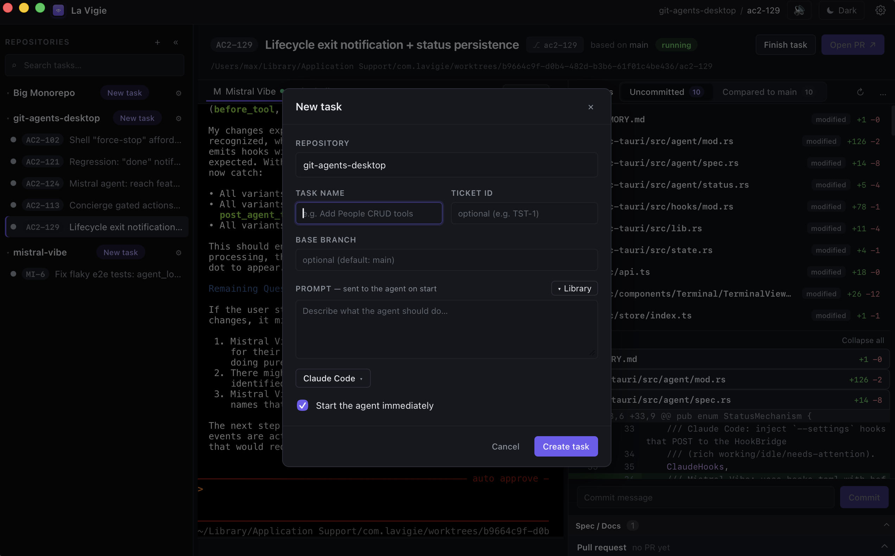
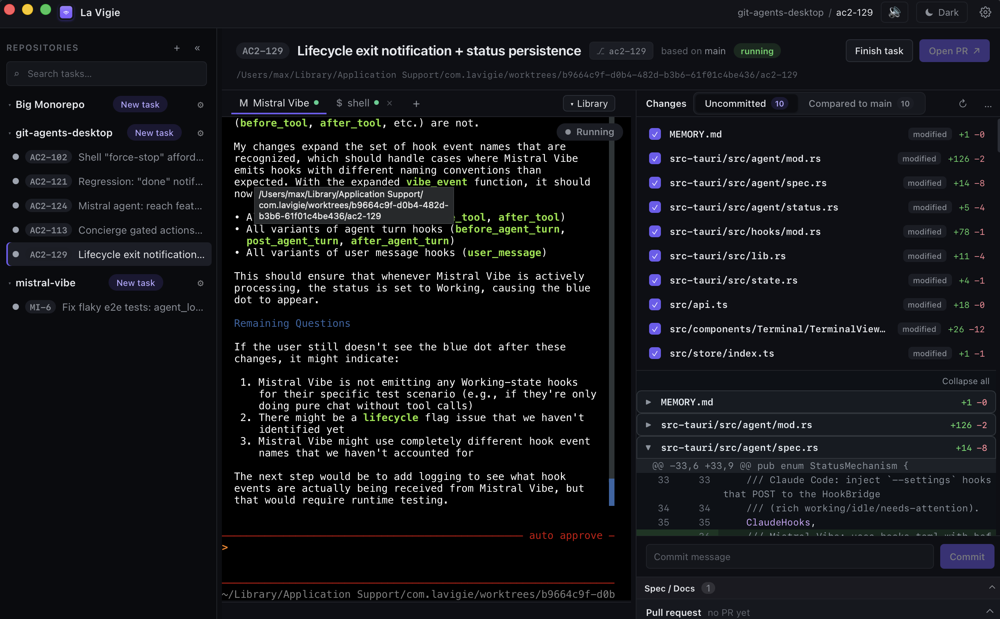
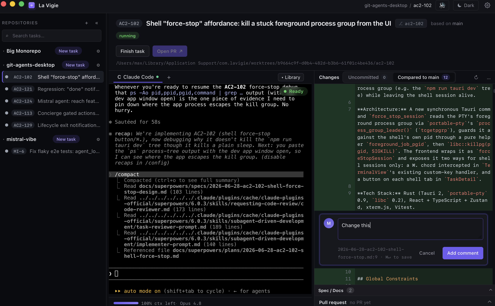
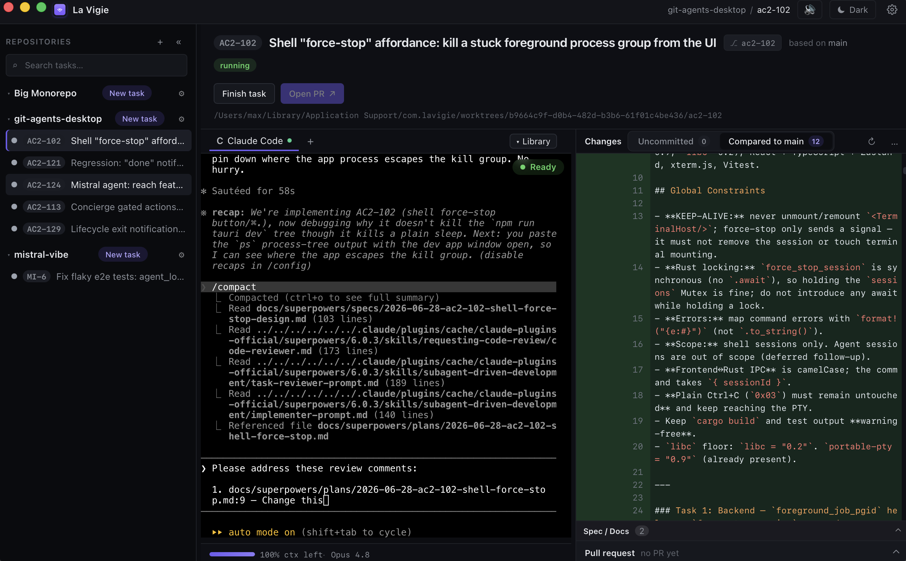
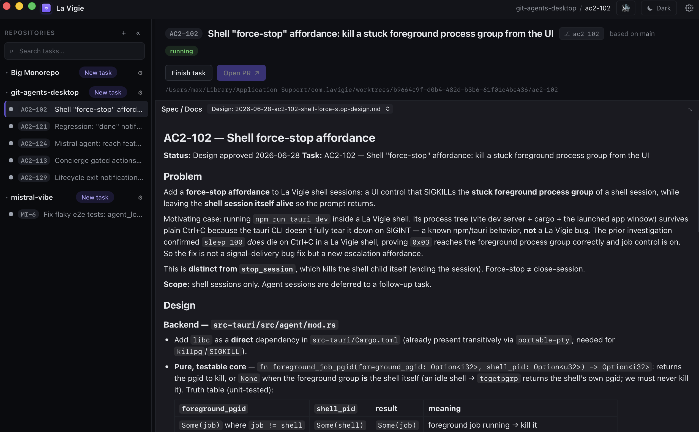

# Getting Started

A quick tour of La Vigie's core loop: create a task, run an agent in it, review the
diff, and steer the agent — all from one window. Before you start, make sure you've
installed the [prerequisites](../README.md#prerequisites) and launched the app with
`npm run tauri dev`.

## 1. Create a task

Click **New task** next to a repository to open this dialog. A task is a git worktree +
branch, so all you need to give it is a **task name** (used to slugify the branch) and,
optionally, a **ticket ID** and a non-default **base branch**. Type a **prompt** to send
to the agent the moment it starts (or pick a saved one from the **Library**), choose which
agent engine to run (e.g. Claude Code), and leave **Start the agent immediately** checked
to spin everything up in one go.

### Repository initial prompt

A repository can carry a shared **initial prompt** that's prepended to every new task's prompt
on launch — handy for house rules or context every agent in that repo should start with. Set it
from the repository's **⚙ settings**: enable **Auto-start agent on task creation**, then fill in
the **Initial prompt** field. When a repo has one, the New task dialog shows a **Skip the
repository prompt for this task** checkbox — tick it to launch that one task with only your
task prompt (or a bare agent, if you leave the task prompt empty).

## 2. The task workspace

Once a task is running you get the full workspace. The **left sidebar** lists your
repositories and their tasks; the **center pane** is the embedded terminal where the agent
runs (with tabs for the agent and extra `shell` sessions), and a live status pill shows
what it's doing — here, **Running**. The **right pane** ("Changes") tracks the worktree's
diff, with tabs for **Uncommitted** changes and everything **Compared to main**, a
checklist of modified files, and a commit box at the bottom.

## 3. Review the diff and comment on it

Expand any file in the Changes panel to read a GitHub-style, syntax-highlighted diff.
Click a line to attach an inline **comment** — just like reviewing a pull request — and
write your feedback (here, "Change this"). The comment is anchored to the exact file and
line so the agent knows precisely what you're referring to.

## 4. Send your feedback to the agent

Your saved comments are collected and handed straight to the agent as a prompt —
"Please address these review comments: …" — each one carrying its `file:line` reference.
This closes the review loop without leaving the app: read the diff, mark it up, and the
agent picks up your notes and keeps working.

## 5. Read the spec and docs

The **Spec / Docs** dock (bottom of the right pane) renders the task's Markdown specs and
design docs inline, so the plan the agent is working from stays one click away. Use it to
keep the intent, constraints, and acceptance criteria in view while you review the code.

---

That's the core loop. From here you can commit changes, open and merge a PR via the `gh`
CLI, and clean up the worktree when the task is done — see the main
[README](../README.md) and [CONTRIBUTING.md](../CONTRIBUTING.md) for the full workflow.
