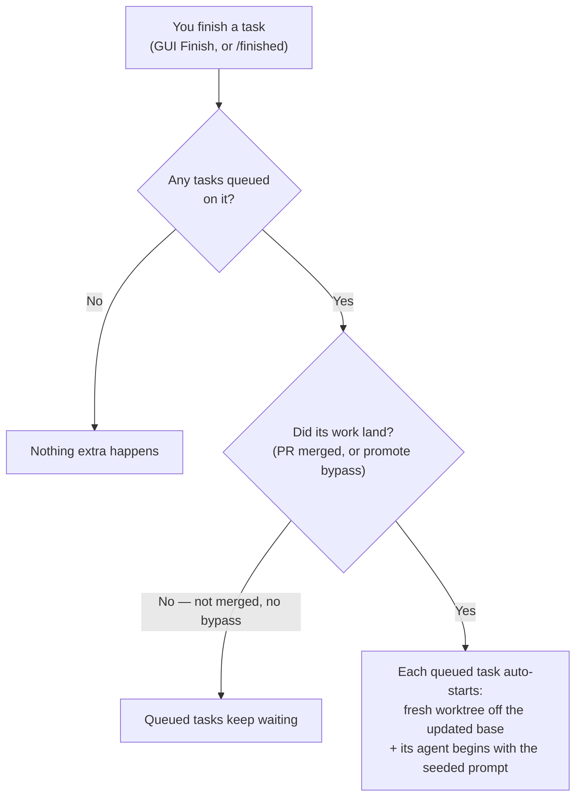
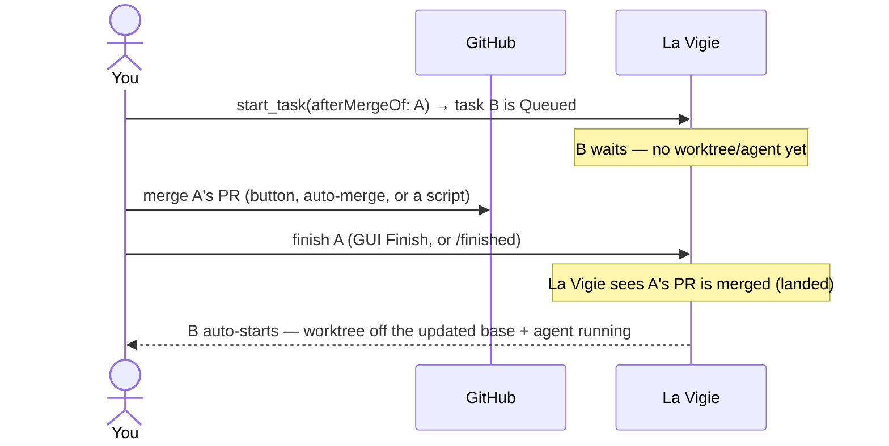

# Task dependencies (start-on-merge)

Queue a task to **auto-start when another task lands**. Instead of babysitting a follow-up — waiting
for the first task's PR to merge, then manually creating and starting the next one — you dispatch the
follow-up up front as *queued*, and La Vigie starts it the moment its dependency lands.

## Queuing a task

A running agent queues a follow-up through the La Vigie MCP tool `start_task`, passing
`afterMergeOf` — the id of the task it should wait for (typically the agent's own current task, from
`LAVIGIE_TASK_ID`):

```
start_task(title: "Follow-up work", afterMergeOf: "<blocking task id>", prompt: "…")
```

The new task is created in a **Queued** state:

- a task row exists and shows in the sidebar with a distinct *queued* dot,
- but it has **no worktree, no branch, and no agent** yet.

`start_task` confirms the queue rather than pretending it started:

> Queued task `<id>` (Pending) — will auto-start when task `<blocker>` (`<title>`) lands. No
> worktree/branch yet; it unblocks automatically when that task's PR merges (detected at
> finish/teardown), or immediately via `/finished` with `promote=true` for a no-PR landing.

## What "landed" means, and when dependents fire

Queued tasks start when their dependency has **landed** — its work is in the base branch. La Vigie
checks this when you **finish** the dependency (through *any* finish surface: the GUI **Finish**
button, or the `/finished` teardown):

- **The dependency has a PR** → landed is detected automatically when that PR is **merged** — however
  it was merged (the GitHub merge button, auto-merge, a merge script, or La Vigie's own merge). You
  don't have to merge *through* La Vigie; you just have to finish the task afterwards.
- **No PR** → nothing is auto-detected, so a queued dependent stays queued. If the work landed
  without a PR and you want the dependents to start, assert it explicitly with the **promote bypass**
  (see below).



The typical flow — merge the PR wherever you like, then finish the task:



A promoted task's worktree is created off the **freshly-updated** base branch, so it already contains
the dependency's merged work.

## The promote bypass (no-PR landings)

When work lands without a La Vigie-visible PR merge, pass `promote=true` so queued dependents start:

- via the `/finished` skill's promote option, or
- directly against the HookBridge:

  ```bash
  curl -s -X POST "http://127.0.0.1:$LAVIGIE_HOOK_PORT/finish/<taskId>?force=true&promote=true"
  ```

  (`force=true` skips the teardown safety gate for a task with unmerged commits and no PR;
  `promote=true` asserts the work landed and starts its dependents.)

## Cancelling a queued task

A queued task has no worktree, so cancelling it is just a delete — right-click it in the sidebar →
**Delete**. It disappears with no git teardown.

## Notes & limitations

- **One dependency per task** for now (`afterMergeOf` takes a single task). The underlying model
  already supports many-to-one, so "wait on several tasks" is a future addition with no migration.
- If a dependency is finished **without landing** (e.g. discarded, or kept without a merged PR and no
  promote bypass), its queued dependents stay queued rather than starting — cancel them manually if
  they're no longer wanted.
- Fully hands-off firing — promoting dependents on a PR merge you *never* finish in La Vigie — is a
  planned follow-up (external-merge polling); today the trigger runs when you finish the dependency.
